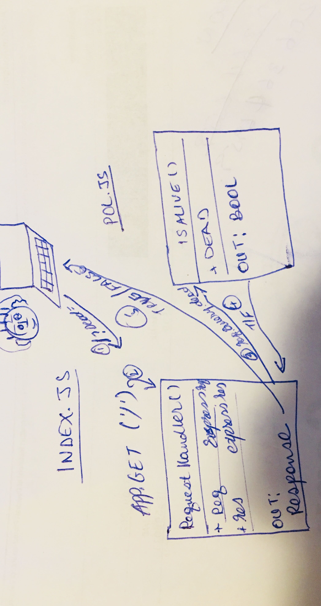

# LAB - 00

## Proof of Life Server

### Author: Eyob Tamir

### Links and Resources

- [submission PR](https://github.com/eyobtamir-401n16/lab-00/pull/1)
- [ci/cd](https://travis-ci.com/github/eyobtamir-401n16/lab-00) 
- [front-end application](https://eyobtamir-lab-00.herokuapp.com/)

### Documentation
- [jsdocs](https://eyobtamir-lab-00.herokuapp.com/docs/)

### Setup

#### `.env` requirements (where applicable)

i.e.

- `PORT` - port3000

#### How to initialize/run your application (where applicable)

- e.g. `npm start`

#### How to use your library (where applicable)

#### Tests

Unit Tests: 'npm test'
Lint Tersts:'npm run lint'

#### UML

